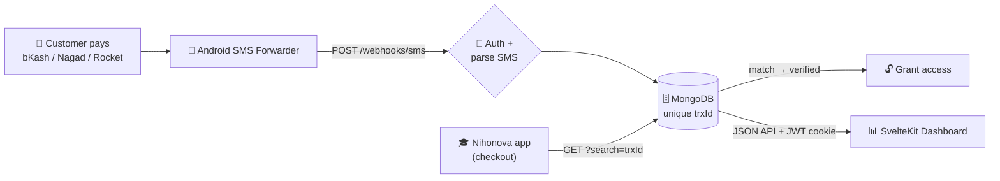

# 💸 SMS Payment Verification Gateway

**A microservice that turns a personal mobile-money number into an automated payment gateway — powering real revenue for [Nihonova Academy](https://www.nihonovaacademy.com/), a JLPT e-learning SaaS.**

[](https://nodejs.org)
[](https://www.mongodb.com)
[](#️-tech-stack)
[](#-run-it)
[](#-run-it)

**🎓 Main app:** [nihonovaacademy.com](https://www.nihonovaacademy.com/)

---

## The Problem → The Solution

**[Nihonova Academy](https://www.nihonovaacademy.com/)** sells JLPT mock tests and ebooks online in Bangladesh — where small SaaS businesses can't easily access card gateways or automated bKash/Nagad/Rocket APIs. Payments landed on a personal bKash number and were verified **by hand**: read the SMS, check the amount and transaction ID, grant access. Slow, error-prone, unscalable.

This service **automates that loop**. A payment SMS is forwarded from an Android phone to a webhook, parsed into a structured transaction, and stored in MongoDB (deduplicated by transaction ID). The main app then verifies any payment by querying for its `trxId` and **instantly unlocks** the purchased content — a decoupled payment layer that gives the SaaS programmatic access to money arriving over SMS.

## 🏗️ Architecture

A two-app monorepo: a standalone **Express API** ingests and serves the data, and a separate **SvelteKit** single-page dashboard reads it over a credentialed JSON API.



<details>
<summary>ASCII fallback</summary>

```
Customer pays → Android forwarder → POST /webhooks/sms
                                        │ auth + parse
                                        ▼
                              MongoDB (unique trxId)
                              ▲                    │
   Nihonova app ── GET ?search=trxId               └─► SvelteKit dashboard
        └─► match → grant access to purchased content
```
</details>

**Why a separate service?** SMS ingestion, provider-specific parsing, and idempotency are a distinct concern with their own failure modes (retries, duplicates, malformed text). Isolating them keeps the main SaaS clean and independently deployable. The dashboard is a decoupled SPA that talks to the same read API — no server-rendered coupling between UI and data.

## 📁 Repository Layout

```
apps/
  server/    Express 5 API — webhook ingestion, parsers, admin data API, auth
    src/
      routes/       webhook.js · admin.js · auth.js
      services/     parsePayment + per-provider parsers · jwt.js · timeUtil.js
      models/       createPaymentModel factory · Bkash/Nagad/Rocket · User · WebhookEvent
      middleware/   verifySignature.js
      config/       db.js (warm-connection-aware Mongoose)
    Dockerfile · docker-compose.yml
  web/       SvelteKit 2 + Svelte 5 dashboard (Chart.js), deploys to Vercel
    src/
      routes/       dashboard · transactions · reports · health
      lib/          typed api.ts client · Chart.svelte · auth/alerts stores
```

## ✨ Highlights

- **Multi-provider parsing** — pure regex parsers for **bKash** (multiple formats), **Nagad**, and **Rocket/DBBL**, each stored in its own collection.
- **Idempotent ingestion** — `trxId` is a **unique index**, so retried SMS can't duplicate a payment; the webhook always returns `200` to stop gateway retries. Rejected/odd events are logged to a `WebhookEvent` collection for the health view.
- **JWT session auth** — dashboard login is a bcrypt compare against a `users` collection that issues an **httpOnly JWT cookie** (`SameSite=None; Secure` cross-origin). A legacy timing-safe `ADMIN_TOKEN` header is still accepted for scripts.
- **Live analytics dashboard** — a **SvelteKit SPA** with **Chart.js**: per-platform totals, payments/revenue per day, custom date-range reports with a top-senders breakdown, peak-hours histogram, and a data-freshness/health page — all bucketed in **Bangladesh time (UTC+6)** from UTC-stored timestamps.
- **Fast responses** — gzip/brotli compression on the API and field-projected list queries keep the large raw SMS text off the wire.

## 🛠️ Tech Stack

| Layer | Technology |
|---|---|
| **API** | Node.js · Express 5 · `compression` |
| **Data** | MongoDB · Mongoose 9 |
| **Dashboard** | SvelteKit 2 · Svelte 5 (runes) · TypeScript · Chart.js |
| **Auth** | bcrypt + JWT httpOnly cookie · legacy `timingSafeEqual` token |
| **Infra** | Docker / docker-compose (API) · Vercel (dashboard) |

## 🔌 API

| Endpoint | Purpose |
|---|---|
| `GET /health` | Liveness probe |
| `POST /webhooks/sms?token=` | Ingest a forwarded SMS `{ from, text, sim, … }`. Always `200`; body reports `processed` + `reason` (`unmatched` / `duplicate` / …). |
| `POST /admin/auth/login` | `{ username, password }` → sets httpOnly JWT cookie |
| `POST /admin/auth/logout` | Clears the session cookie |
| `GET /admin/auth/me` | `{ username }` if the cookie is valid, else `401` |
| `GET /admin/api/payments` | Auth-gated paginated list — `?platform=&page=&limit=&search=` |
| `GET /admin/api/stats` | Totals + 14-day daily/revenue series + period comparisons + peak-hours histogram |
| `GET /admin/api/reports` | Custom date-range totals/fees/daily series + top-senders — `?from=&to=` |
| `GET /admin/api/health` | Data freshness + webhook-event counts + recent-events log |

> **Verification is query-based by design** — the main app hits `/admin/api/payments?search=<trxId>` and matches the ID/amount. No `/verify` endpoint and no stored `verified` flag; the DB's unique `trxId` *is* the source of truth. Admin routes accept the session cookie, or the legacy token via `?token=`, `x-admin-token`, or `Authorization: Bearer`.

## 🗄️ Data Model

Each provider gets its own collection (`bkash`, `nagad`, `rocket`) from one shared schema factory. Fields: `amount`, `sender` (phone or masked account), `fee`, `balance`, **`trxId` (unique — idempotency key)**, `dateReceived` (UTC, indexed), raw date/time strings, `simNumber`, `rawMessage`, timestamps — plus `ref` for Nagad. A `users` collection holds dashboard credentials (`username`, `passwordHash`), and `WebhookEvent` logs rejected/notable ingest events for the health view. Only **incoming money** is stored; timestamps convert BDT (UTC+6) → UTC with raw strings preserved.

## 🚀 Run It

### API (`apps/server`)

```bash
cd apps/server
npm install
cp .env.example .env      # MONGO_URI, WEBHOOK_SECRET, JWT_SECRET, CORS_ORIGIN, *_SENDER
npm run seed-admin        # create the first dashboard user
npm run dev               # or: npm start
```

Or run the API + MongoDB together with Docker:

```bash
cd apps/server
docker compose up -d
```

Point the "Incoming SMS to URL Forwarder" Android app at `https://your-api-domain.com/webhooks/sms?token=<WEBHOOK_SECRET>`.

### Dashboard (`apps/web`)

```bash
cd apps/web
npm install
# set PUBLIC_API_BASE_URL to the API origin (for credentialed cross-origin cookies)
npm run dev               # or: npm run build  → deploy to Vercel
```

## 💡 Engineering Notes

Idempotent webhook design over an at-least-once delivery source · resilient regex parsing of messy real-world SMS across 3 providers · UTC storage with local-time (UTC+6) analytics · a decoupled SvelteKit SPA over a typed, credentialed JSON API · httpOnly-JWT session auth with fail-closed production config · compression + projected queries for lean responses.

---

**Moshiur Rahman** · Built to power real payments for **[Nihonova Academy](https://www.nihonovaacademy.com/)**.
