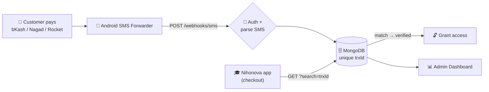

# 💸 SMS Payment Verification Gateway

**A microservice that turns a personal mobile-money number into an automated payment gateway — powering real revenue for [Nihonova Academy](https://www.nihonovaacademy.com/), a JLPT e-learning SaaS.**

[](https://nodejs.org)
[](https://www.mongodb.com)
[](#-admin-dashboard)
[](https://sms-server-iota.vercel.app/)

**🔗 Live demo:** [sms-server-iota.vercel.app](https://sms-server-iota.vercel.app/) &nbsp;·&nbsp; **🎓 Main app:** [nihonovaacademy.com](https://www.nihonovaacademy.com/)

---

## The Problem → The Solution

**[Nihonova Academy](https://www.nihonovaacademy.com/)** sells JLPT mock tests and ebooks online in Bangladesh — where small SaaS businesses can't easily access card gateways or automated bKash/Nagad/Rocket APIs. Payments landed on a personal bKash number and were verified **by hand**: read the SMS, check the amount and transaction ID, grant access. Slow, error-prone, unscalable.

This service **automates that loop**. A payment SMS is forwarded from an Android phone to a webhook, parsed into a structured transaction, and stored in MongoDB (deduplicated by transaction ID). The main app then verifies any payment by querying for its `trxId` and **instantly unlocks** the purchased content — a decoupled payment layer that gives the SaaS programmatic access to money arriving over SMS.

## 🏗️ Architecture



<details>
<summary>ASCII fallback</summary>

```
Customer pays → Android forwarder → POST /webhooks/sms
                                        │ auth + parse
                                        ▼
                              MongoDB (unique trxId)
                              ▲                    │
   Nihonova app ── GET ?search=trxId               └─► Admin Dashboard
        └─► match → grant access to purchased content
```
</details>

**Why a separate service?** SMS ingestion, provider-specific parsing, and idempotency are a distinct concern with their own failure modes (retries, duplicates, malformed text). Isolating them keeps the main SaaS clean and independently deployable.

## ✨ Highlights

- **Multi-provider parsing** — pure regex parsers for **bKash** (4 formats), **Nagad**, **Rocket/DBBL**, each in its own collection.
- **Idempotent ingestion** — `trxId` is a **unique index**, so retried SMS can't duplicate a payment; the webhook always returns `200` to stop gateway retries.
- **Timing-safe token auth** on webhook + admin API (`crypto.timingSafeEqual`); production fails closed on unset/placeholder secrets.
- **Live analytics dashboard** — server-rendered **EJS + htmx + Alpine.js + Chart.js**: per-platform totals, payments-per-day, and revenue-per-day, bucketed in **Bangladesh time (UTC+6)** from UTC-stored timestamps.
- **Serverless-ready** — deploys to Vercel with a warm-connection-aware MongoDB layer.

## 🛠️ Tech Stack

| Layer | Technology |
|---|---|
| **API** | Node.js · Express 5 |
| **Data** | MongoDB · Mongoose 9 |
| **Frontend** | EJS 6 (SSR) · htmx · Alpine.js · Chart.js *(CDN)* |
| **Auth / Infra** | Shared-secret tokens (`timingSafeEqual`) · Vercel serverless |

## 🔌 API

| Endpoint | Purpose |
|---|---|
| `GET /health` | Liveness probe |
| `POST /webhooks/sms?token=` | Ingest a forwarded SMS `{ from, text, sim, … }`. Always `200`; body reports `processed` + `reason` (`unmatched` / `duplicate`). |
| `GET /admin/api/payments` | Token-gated paginated list — `?platform=&page=&limit=&search=` |
| `GET /admin/api/stats` | Token-gated totals + 14-day daily counts + revenue series |

> **Verification is query-based by design** — the main app hits `/admin/api/payments?search=<trxId>` and matches the ID/amount. No `/verify` endpoint and no stored `verified` flag; the DB's unique `trxId` *is* the source of truth. Admin token accepted via `?token=`, `x-admin-token`, or `Authorization: Bearer`.

## 🗄️ Data Model

Each provider gets its own collection (`bkash`, `nagad`, `rocket`) from one shared schema factory. Fields: `amount`, `sender` (phone or masked account), `fee`, `balance`, **`trxId` (unique — idempotency key)**, `dateReceived` (UTC), raw date/time strings, `simNumber`, `rawMessage`, timestamps — plus `ref` for Nagad. Only **incoming money** is stored; timestamps convert BDT (UTC+6) → UTC with raw strings preserved.

## 🚀 Run It

```bash
npm install
cp .env.example .env      # set MONGO_URI, WEBHOOK_SECRET, ADMIN_TOKEN, *_SENDER
npm run dev               # or: npm start
```

Point the "Incoming SMS to URL Forwarder" app at `https://your-domain.com/webhooks/sms?token=<WEBHOOK_SECRET>`. Deploy on Vercel (`vercel.json` routes to `api/index.js`).

## 💡 Engineering Notes

Idempotent webhook design over an at-least-once delivery source · resilient regex parsing of messy real-world SMS across 3 providers · UTC storage with local-time analytics · an interactive dashboard (charts, search, pagination, auth gate) with **no SPA framework** · serverless connection reuse and fail-closed config.

---

**Moshiur Rahman** · Built to power real payments for **[Nihonova Academy](https://www.nihonovaacademy.com/)**.
