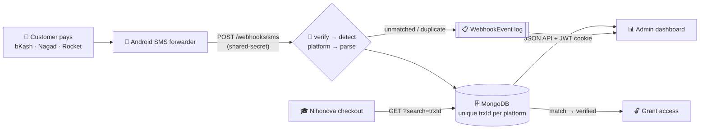

# 💸 SMS Payment Verification Gateway

**A microservice that turns a personal mobile-money number into a real payment gateway — parsing and settling ~500 live transactions every month for [Nihonova Academy](https://www.nihonovaacademy.com/), a JLPT e-learning SaaS.**

[](#️-tech-stack)
[](#️-data-model)
[](#-the-admin-dashboard)
[](#-run-it)
[](#-run-it)

**🎓 Live product:** [nihonovaacademy.com](https://www.nihonovaacademy.com/) &nbsp;·&nbsp; **📦 Project page:** [github.com/mrahmann0010/smsServer](https://github.com/mrahmann0010/smsServer)

---

## 🎯 The Problem → The Solution

Nihonova Academy sells JLPT mock tests and ebooks online in Bangladesh — a market where a small SaaS
business **cannot get a card gateway or an automated bKash/Nagad/Rocket merchant API** without
enterprise paperwork and per-transaction fees. Payments landed on a personal mobile-money number and
were verified **by hand**: read the SMS, eyeball the amount and transaction ID, unlock the content.
Slow, error-prone, and impossible past a few dozen orders a month.

This service automates that loop end to end:

> A customer pays → the payment SMS hits an Android phone → the phone forwards it to a signed
> webhook → the text is parsed into a structured transaction → stored in MongoDB, deduplicated by
> `trxId` → the main app queries that ID at checkout and **unlocks the purchase instantly**.

The result is a **programmatic payment rail built on top of SMS** — money that used to arrive as
unstructured text is now queryable, auditable data.



<details>
<summary>ASCII fallback</summary>

```
Customer pays → Android forwarder → POST /webhooks/sms
                                       │ verify · parse · dedupe
                                       ▼
                             MongoDB (unique trxId)          WebhookEvent log
                             ▲                   │                  │
  Nihonova checkout ── ?search=trxId             └──► Admin dashboard ◄┘
       └─► match → grant access to purchased content
```
</details>

**Why a separate service?** SMS ingestion, provider-specific parsing, and idempotency have their own
failure modes — retries, duplicates, malformed text, a phone that goes offline. Isolating them keeps
the main SaaS clean, independently deployable, and unaware that its "payment gateway" is a phone.

---

## ⚙️ The Backend

The heart of the project. Express 5 + Mongoose 9, no framework magic — every design decision below
exists because a real payment went through it.

### Ingestion is idempotent by construction

The SMS forwarder delivers **at least once**: a flaky mobile connection means the same payment text
can arrive two or three times. Rather than bolting on a dedup table, `trxId` carries a **unique
index** in each collection — a retry fails at the database with error `11000`, which the route
translates into `{ processed: false, reason: 'duplicate' }`. The idempotency key *is* the schema.

The webhook also **always answers `200`** for anything it understands as "not a payment" — an
unknown sender, a promotional SMS, an outgoing-money notification. A `4xx` would make the forwarder
retry forever; a `200` retires the message. Only a genuine server fault returns `500`, because that
one *should* be retried.

### Parsing messy real-world text

Three pure-function parsers (`bkashParser` · `nagadParser` · `rocketParser`) sit behind a
`parsePayment` dispatcher that detects the provider and emits one normalized shape:

```js
{ platform, amount, sender, fee, balance, trxId, dateReceived, rawDate, rawTime, ref? }
```

bKash alone ships several message formats (received / deposit / i-banking deposit), and only
**incoming money** is ever stored — outgoing payments are recognized and deliberately discarded.
Parsers are pure and side-effect free, so a new provider format is a regex plus a test case, not a
change to the ingest path.

### Timezone correctness

Every timestamp is stored in **UTC**, but the business runs on the Bangladesh calendar. All
"per day" and period bucketing shifts to **UTC+06:00** before grouping, so a payment at 11:40pm Dhaka
time lands on the right day instead of tomorrow. The original local-time strings printed inside the
SMS are kept verbatim alongside the parsed `Date`, so an admin can always compare against a
student's screenshot character for character.

### Operational hardening

- **Fail-fast database lifecycle** — one Mongoose connection opened before the listener, with a
  tuned pool (`maxPoolSize 20`), a 5s server-selection timeout instead of the 30s default, and a
  bounded 5s buffer so a blip doesn't drop a webhook but an outage doesn't hang every request.
  Concurrent callers during startup are deduped so a burst can't open two connections.
- **Ingestion-health log** — rejected and notable events (`unknown_sender`, `unmatched`,
  `duplicate`, `error`) are written fire-and-forget to a `WebhookEvent` collection. A logging
  failure can never delay or fail the webhook response.
- **Structured event logging** — a small `logger` service emits `LEVEL SCOPE event {fields}` lines
  that stay greppable in production.
- **Signed webhook** — `verifySignature` gates `/webhooks/sms` on `WEBHOOK_SECRET`.
- **Session auth** — bcrypt compare against a `users` collection issues an **httpOnly JWT cookie**
  (`SameSite=None; Secure` cross-origin). JS never touches the token; credentialed CORS echoes the
  exact request origin, never `*`.
- **Lean responses** — gzip/brotli compression plus field-projected list queries keep the bulky raw
  SMS text off the wire.

### 🔌 API

| Endpoint | Purpose |
|---|---|
| `GET /health` | Liveness probe |
| `POST /webhooks/sms?token=` | Ingest a forwarded SMS `{ from, text, sim, … }`. Always `200`; body reports `processed` + `reason`. |
| `POST /admin/auth/login` | `{ username, password }` → sets the httpOnly JWT cookie |
| `POST /admin/auth/logout` | Clears the session cookie |
| `GET /admin/auth/me` | `{ username }` if the cookie is valid, else `401` |
| `GET /admin/api/payments` | Paginated list — `?platform=&page=&limit=&search=` |
| `GET /admin/api/stats` | Totals · 14-day daily/revenue series · period comparisons · peak-hours histogram |
| `GET /admin/api/reports` | Custom date-range totals/fees/daily series + top senders — `?from=&to=` |
| `GET /admin/api/health` | Data freshness · webhook-event counts · recent-events log |

> **Verification is query-based by design.** The main app hits
> `/admin/api/payments?search=<trxId>` and matches ID and amount. There is no `/verify` endpoint and
> no stored `verified` flag — the unique `trxId` in the database *is* the source of truth, which
> means verification can't drift out of sync with ingestion.

### 🗄️ Data model

One shared schema factory (`createPaymentModel`) builds three collections — `bkash`, `nagad`,
`rocket` — so providers never collide on lookalike transaction IDs while sharing one shape:
`amount`, `sender`, `fee`, `balance`, **`trxId` (unique)**, `dateReceived` (UTC, indexed), the raw
date/time strings, `simNumber`, `rawMessage`, timestamps — plus `ref` for Nagad. Sender identity is
the phone string, treated as shared across platforms, which is what makes the top-senders view
possible. A `users` collection holds dashboard credentials; `WebhookEvent` holds the ingest log.

---

## 📊 The Admin Dashboard

A **SvelteKit 2 / Svelte 5 (runes)** single-page app on the Nihonova design system — the operator's
window into the money. It is not a CRUD table; it's a monitoring tool built around one question:
*is the pipeline still trustworthy right now?*

- **Live analytics** — per-platform totals, revenue and payment counts per day, period-over-period
  comparisons, and a peak-hours histogram, all drawn with Chart.js and bucketed in Bangladesh time.
- **Infinite-scroll ledger** — `createInfiniteQuery` with debounced search over `trxId` or sender,
  platform filtering, and a detail modal showing the original SMS. Pages are de-duplicated by
  `platform + trxId`, and the desktop table collapses into stacked cards below 720px.
- **Custom reports** — pick any date range for totals, fees, a daily series, and a top-senders
  breakdown.
- **Pipeline trust alerts** — a masthead bell recomputes alerts from the latest stats and health
  whenever either refreshes, distinguishing *"this platform was never wired up"* from *"this
  forwarder went quiet"* — the difference between a config gap and lost revenue.
- **Health view** — data freshness, webhook-event counts, and a recent-rejections log, so an
  unparsed message format surfaces as a signal instead of a silent gap.
- **Near-instant freshness without hammering the API** — all data flows through TanStack Query v6
  (runes API): a 10-minute background poll as a light fallback, with refetch-on-window-focus doing
  the real work. Any `401` triggers a global logout.
- **Honest states** — separate components for *empty* (neutral, "nothing here yet"), *error* ("the
  forwarder stopped"), and *load failure*. An empty day must never look like a broken pipeline.

Design system: **Tailwind v4** with all tokens in a single `@theme` block — no raw hex, no
`<style>` blocks, no per-component CSS. Every identifier, amount, and timestamp is set in JetBrains
Mono with tabular figures so an admin can compare it against a student's screenshot at a glance.

---

## 🛠️ Tech Stack

| Layer | Technology |
|---|---|
| **API** | Node.js 20 · Express 5 · `compression` · `cookie-parser` |
| **Data** | MongoDB · Mongoose 9 (schema factory, unique + date indexes) |
| **Auth** | bcrypt · JSON Web Tokens in an httpOnly cookie · credentialed CORS |
| **Dashboard** | SvelteKit 2 · Svelte 5 runes · TypeScript · TanStack Query v6 · Chart.js · Tailwind v4 |
| **Infra** | Docker / docker-compose (API) · Vercel `adapter-vercel` (dashboard) |

**Repository layout** — a two-app monorepo, each app independently installed and deployed:

```
apps/
  server/    Express 5 API — webhook ingestion, parsers, data API, auth
    src/routes/       webhook.js · admin.js · auth.js
    src/services/     parsePayment + 3 provider parsers · jwt.js · logger.js · timeUtil.js
    src/models/       createPaymentModel factory · Bkash/Nagad/Rocket · User · WebhookEvent
    src/middleware/   verifySignature.js
    src/config/       db.js (pooled, fail-fast Mongoose lifecycle)
    Dockerfile · docker-compose.yml
  web/       SvelteKit 2 + Svelte 5 dashboard
    src/routes/       dashboard · transactions · reports · health
    src/lib/          typed api.ts client · query.ts · components/ · stores/
```

---

## 🚀 Run It

### API (`apps/server`)

```bash
cd apps/server
npm install
cp .env.example .env      # MONGO_URI · WEBHOOK_SECRET · JWT_SECRET · CORS_ORIGIN · *_SENDER
npm run seed-admin        # create the first dashboard user
npm run dev               # or: npm start
```

Or bring up the API and MongoDB together:

```bash
cd apps/server
docker compose up -d
```

Then point the "Incoming SMS to URL Forwarder" Android app at
`https://your-api-domain.com/webhooks/sms?token=<WEBHOOK_SECRET>`.

### Dashboard (`apps/web`)

```bash
cd apps/web
npm install
# set PUBLIC_API_BASE_URL to the API origin (required for credentialed cross-origin cookies)
npm run dev               # → http://localhost:5173
npm run check             # type/lint gate — expects 0 errors, 0 warnings
npm run build             # deploy to Vercel
```

Sign in with the credentials created by `npm run seed-admin`. The dashboard is a pure SPA: it holds
session state only and reads every byte of data from the API over credentialed requests, so it can
be deployed to a different origin from the API without any shared runtime.

---

## 📈 Business Impact

| | |
|---|---|
| **~500 transactions / month** | Parsed, deduplicated, and made queryable in real time — with no human reading a single SMS. |
| **0% gateway commission** | Bangladeshi payment gateways and MFS merchant APIs charge per transaction. Running on a personal mobile-money number keeps that percentage as **retained revenue** for every order. |
| **Manual → instant verification** | Checkout resolves a `trxId` against the database and unlocks content immediately, instead of waiting on an admin to wake up and check a phone. |
| **Unblocked a market** | Card gateways are effectively out of reach for a small Bangladeshi SaaS. This is what made online selling possible at all. |
| **Auditable by default** | Every payment keeps its raw SMS and original local timestamps; every rejection is logged. Disputes are resolved by lookup, not by memory. |

---

## 💡 Engineering Notes

Idempotent webhook design over an at-least-once delivery source · resilient regex parsing of messy
real-world SMS across three providers · UTC storage with UTC+6 business-calendar analytics · a
fail-fast pooled database lifecycle · fire-and-forget ingestion-health logging that can never drop a
payment · httpOnly-JWT session auth with fail-closed production config · a decoupled Svelte 5 SPA
over a typed, credentialed JSON API.

---

**Moshiur Rahman** · Built to power real payments for **[Nihonova Academy](https://www.nihonovaacademy.com/)**.
