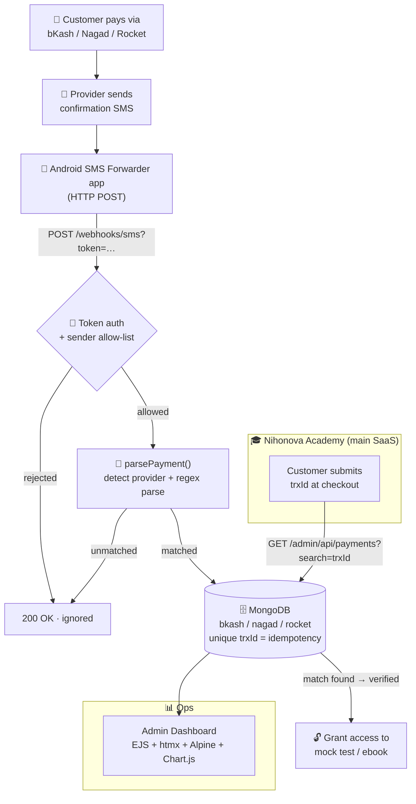

# 💸 SMS Payment Verification Gateway

**An SMS-driven payment automation microservice that turns a personal mobile-money number into an automated payment gateway — powering real revenue for [Nihonova Academy](https://www.nihonovaacademy.com/), a JLPT e-learning SaaS.**

[](https://nodejs.org)
[](https://www.mongodb.com)
[](#-admin-dashboard)
[](https://sms-server-iota.vercel.app/)
[](https://sms-server-iota.vercel.app/)

**🔗 Live demo:** [sms-server-iota.vercel.app](https://sms-server-iota.vercel.app/) &nbsp;·&nbsp; **🎓 Main app:** [nihonovaacademy.com](https://www.nihonovaacademy.com/)

---

## Overview

This is a lightweight **payment-verification microservice** that ingests mobile-money payment SMS (bKash, Nagad, Rocket), parses them into structured transaction records, stores them in MongoDB, and exposes a token-secured API and analytics dashboard. It lets a business accept payments on ordinary personal mobile-money accounts and verify them **automatically** — no merchant account, no payment-gateway contract, no manual reconciliation.

It was built to solve a concrete, real-world problem for a live product.

---

## 🧩 The Problem

**[Nihonova Academy](https://www.nihonovaacademy.com/)** is a Japanese-language e-learning SaaS platform in Bangladesh that helps students prepare for the **JLPT** (Japanese-Language Proficiency Test) and sells digital products — **mock tests** and **ebooks**.

In Bangladesh, small SaaS businesses hit a wall at checkout:

- **No easy access to card gateways.** Direct credit/debit card acceptance requires merchant onboarding that is slow, costly, and often out of reach for a small platform.
- **No plug-and-play mobile-money API.** The dominant payment methods — **bKash, Nagad, Rocket** — are not trivially available as automated gateways to individuals/small merchants.
- **So payments were manual.** Customers paid into a **personal bKash number**, then someone had to read the confirmation SMS, eyeball the amount and transaction ID, cross-check it against the order, and manually grant access.

That manual loop was **slow, error-prone, and impossible to scale** — every sale required a human in the middle.

---

## ✅ The Solution

This microservice **automates the entire verification loop**.

When a customer pays into the personal mobile-money account, the provider sends a confirmation SMS to a phone. An Android SMS-forwarding app POSTs that raw SMS to this service, which **detects the provider, parses the message into a structured transaction, and stores it in MongoDB** — deduplicated by transaction ID. The **main Nihonova Academy application** then verifies any payment by querying this service for the matching transaction ID / sender / amount and **instantly unlocks** the purchased mock test or ebook.

In effect, it's a **microservice payment layer** that sits beside the main app and gives it programmatic, automated access to money that arrives over SMS.

---

## 🏗️ Architecture

This service is a **decoupled microservice**: the main Nihonova app never touches SMS or parsing — it just asks *"has transaction X been received?"*



<details>
<summary>ASCII fallback (if Mermaid doesn't render)</summary>

```
   Customer pays (bKash / Nagad / Rocket)
              │
              ▼
   Provider sends confirmation SMS  ──►  Android SMS Forwarder app
                                              │  HTTP POST
                                              ▼
                          ┌──────────────────────────────────────┐
                          │  THIS SERVICE  (Express microservice) │
                          │                                        │
                          │  token auth ─► sender filter ─►        │
                          │  parsePayment() ─► regex parser        │
                          │           │                            │
                          │           ▼                            │
                          │  MongoDB: bkash / nagad / rocket       │
                          │  (unique trxId = idempotency key)      │
                          └───────────────┬───────────┬───────────┘
                                          │           │
        Nihonova main app ── GET ─────────┘           └──► Admin Dashboard
        /admin/api/payments?search=trxId                    (analytics + search)
                    │
                    ▼
        match found → grant access to purchased content
```
</details>

**Why a separate service?** SMS ingestion, provider-specific parsing, and payment storage are a distinct concern with their own failure modes (retries, duplicates, malformed messages). Isolating them keeps the main SaaS clean and lets the payment layer be deployed, scaled, and reasoned about independently.

---

## ✨ Key Features

- **📥 Multi-provider SMS parsing** — pure, regex-based parsers for **bKash** (4 message formats), **Nagad**, and **Rocket/DBBL**, each in its own collection.
- **♻️ Idempotent ingestion** — the transaction ID is a **unique index**, so retried SMS deliveries can never create duplicate payments. The webhook always returns `200` so the gateway stops retrying.
- **🔐 Timing-safe token auth** — both the webhook and the admin API authenticate with shared-secret tokens compared via `crypto.timingSafeEqual`; production refuses to run with unset/placeholder secrets.
- **📊 Live analytics dashboard** — server-rendered **EJS + htmx + Alpine.js + Chart.js**: totals per platform, payments-per-day, share-by-platform, and **revenue-per-day** charts.
- **🌏 Timezone-correct revenue** — timestamps are stored in UTC but bucketed back to **Bangladesh time (UTC+6)** so daily revenue lines up with the local calendar.
- **⚡ Serverless-ready** — deploys to Vercel as a single serverless function with a warm-connection-aware MongoDB layer.

---

## 🛠️ Tech Stack

| Layer | Technology |
|---|---|
| **Runtime / API** | Node.js, **Express 5** |
| **Database** | MongoDB via **Mongoose 9** (ODM) |
| **Views** | **EJS 6** server-side rendering + htmx partials |
| **Frontend** *(CDN)* | **htmx 2**, **Alpine.js 3**, **Chart.js 4** |
| **Auth** | Hand-rolled shared-secret tokens · `crypto.timingSafeEqual` |
| **Config** | dotenv |
| **Infra** | **Vercel** serverless · MongoDB Atlas |
| **Dev** | nodemon |

> The frontend libraries are loaded from a CDN, so the npm dependency footprint stays minimal: `express`, `mongoose`, `ejs`, `dotenv` (+ `nodemon` for dev).

---

## 📊 Admin Dashboard

A token-protected, single-page operations view built **without a frontend framework** — just server-rendered HTML enhanced progressively with htmx and Alpine.

**What it shows**

- **Summary cards** — total count & revenue, broken down for All / bKash / Nagad / Rocket.
- **Payments per day** (stacked bar, last 14 days) and **Share by platform** (doughnut).
- **Revenue per day** (stacked bar, last 14 days) with ৳-formatted tooltips and a running 14-day total.
- **Latest transaction** highlight (htmx-loaded) with a "show last 5" toggle.
- **Transactions page** — filter pills per platform, **debounced search** over `trxId`/`sender`, and a paginated table with Prev/Next.

**How it's built**

- **EJS shells** carry no data (so the page is public), while every data fetch requires the admin token.
- **htmx** swaps in server-rendered partials (`/admin/partials/recent`, `/admin/partials/transactions`) — no client-side JSON rendering.
- **Alpine.js** holds a small `auth` store: it verifies the token against `/admin/api/stats`, caches it in `sessionStorage`, attaches an `x-admin-token` header to every htmx request, and bounces back to the token gate on any `401`.
- **Chart.js** renders the analytics from a single `/admin/api/stats` payload.

---

## 🔌 API Reference

### `GET /health`
Liveness probe → `{ "status": "ok" }`.

### `POST /webhooks/sms?token=<WEBHOOK_SECRET>`
Ingests a forwarded SMS. Auth via the URL token (timing-safe).

**Request body** (sent by the Android forwarder app):

| Field | Type | Description |
|---|---|---|
| `from` | string | Sender ID, e.g. `"bKash"` |
| `text` | string | Raw SMS text |
| `sim` | string | SIM slot the SMS arrived on |
| `sentStamp` / `receivedStamp` | number | Epoch-ms timestamps |

**Response** — always `200` (so the gateway stops retrying) unless a server error occurs:

```json
{ "received": true, "processed": true, "platform": "bkash", "trxId": "AB1234CDEF" }
```

| `processed` | `reason` | Meaning |
|---|---|---|
| `true` | — | Payment stored |
| `false` | `unmatched` | Not a recognized payment SMS |
| `false` | `duplicate` | trxId already stored (retry) |
| `false` | — | Sender not in the allow-list |

### Admin API (token required — `?token=`, `x-admin-token`, or `Authorization: Bearer`)

| Endpoint | Purpose |
|---|---|
| `GET /admin` · `/admin/transactions` | Dashboard & transactions pages |
| `GET /admin/api/payments` | Paginated, filterable list — `?platform=all\|bkash\|nagad\|rocket&page=&limit=&search=` |
| `GET /admin/api/stats` | Totals per platform + 14-day daily counts + revenue series |

> **Payment verification** is query-based by design: the main app hits `GET /admin/api/payments?search=<trxId>` and matches the transaction ID / amount. There is no separate `/verify` endpoint and no stored `verified` flag — the source of truth is simply *"does a record with this trxId exist?"*, guaranteed unique by the database.

---

## 🧾 SMS Parsers

Each parser is a **pure function**: raw SMS string in, structured object (or `null`) out. Only **incoming money** is stored; outgoing payments are parsed but discarded. All timestamps are converted from Bangladesh local time (UTC+6) to UTC, with the raw date/time strings preserved verbatim.

<details>
<summary><strong>bKash</strong> — 4 formats: Send Money, Cash-In deposit, iBanking deposit, Merchant payment</summary>

```
You have received Tk 500.00 from 01712345678. Fee Tk 0.00.
Balance Tk 1,200.00. TrxID AB1234CDEF at 08/06/2026 14:32
```
</details>

<details>
<summary><strong>Nagad</strong> — "Money Received" (optional <code>Ref:</code> line → stored as <code>ref</code>)</summary>

```
Money Received.
Amount: Tk 99.00
Sender: 01634358056
Ref: Saom
TxnID: 75HKUOBF
Balance: Tk 1289.43
08/06/2026 19:00
```
</details>

<details>
<summary><strong>Rocket / DBBL</strong> — single line; sender is a masked account, 12-hour clock</summary>

```
Tk99.00 received from A/C:***515 Fee:Tk0, Your A/C Balance: Tk1,145.85
TxnId:6606781284 Date:08-JUN-26 06:21:43 am.
```
</details>

---

## 🗄️ Data Model

Each provider gets its **own MongoDB collection** (`bkash`, `nagad`, `rocket`), built from one shared schema factory (`createPaymentModel.js`).

| Field | Type | Notes |
|---|---|---|
| `amount` | Number | Payment amount |
| `sender` | String | Phone number, or masked account (Rocket) |
| `fee` | Number | Transaction fee (default `0`) |
| `balance` | Number | Balance after transaction |
| `trxId` | String | **Unique index — idempotency key** |
| `dateReceived` | Date | UTC timestamp (indexed) |
| `timeReceived` / `rawDate` | String | Verbatim local strings from the SMS |
| `simNumber` | Number | SIM slot, or `null` |
| `rawMessage` | String | Original SMS text |
| `ref` | String | **Nagad only** — optional reference note |
| `createdAt` / `updatedAt` | Date | Mongoose timestamps |

---

## 🔒 Security & Reliability

- **Timing-safe token auth** on both the webhook and admin API (`crypto.timingSafeEqual`).
- **Fail-closed in production** — missing/placeholder secrets return `503` rather than silently exposing endpoints.
- **Idempotency** via the unique `trxId` index — duplicate SMS deliveries are safely ignored.
- **Always-`200` webhook contract** — irrelevant/duplicate/unmatched messages are acknowledged so the SMS gateway never enters a retry storm.
- **Warm-connection DB layer** — reuses the Mongoose connection across serverless invocations; returns `503` if the DB is unreachable.
- **Global 404 + error handlers** keep responses consistent and never leak stack traces.

---

## 🚀 Local Setup & Deployment

```bash
# 1. Install
npm install

# 2. Configure — copy .env.example → .env and fill in:
#    PORT, MONGO_URI, WEBHOOK_SECRET, ADMIN_TOKEN,
#    BKASH_SENDER, NAGAD_SENDER, ROCKET_SENDER

# 3. Run
npm run dev      # nodemon, auto-restart
npm start        # production
```

**Android forwarder** — in "Incoming SMS to URL Forwarder", set the webhook URL to:

```
https://your-domain.com/webhooks/sms?token=<WEBHOOK_SECRET>
```

**Deploy (Vercel)** — `vercel.json` routes all traffic to `api/index.js`, which exports the Express app as a serverless function. Set the env vars in the project settings and run `vercel deploy`.

---

## 📁 Project Structure

```
src/
├── app.js                      # Express app: middleware, routes, error handling
├── server.js                   # Local dev entry (app.listen)
├── config/db.js                # Warm-connection-aware Mongoose setup
├── middleware/verifySignature.js  # Webhook token auth (timing-safe)
├── models/
│   ├── createPaymentModel.js   # Shared schema factory
│   └── Bkash.js · Nagad.js · Rocket.js
├── routes/
│   ├── webhook.js              # POST /webhooks/sms
│   └── admin.js                # Dashboard pages + JSON APIs + htmx partials
├── services/
│   ├── parsePayment.js         # Provider dispatcher
│   ├── bkashParser.js · nagadParser.js · rocketParser.js
│   └── timeUtil.js             # BDT → UTC helpers
└── views/                      # EJS pages + partials (home, admin, transactions)
api/index.js                    # Vercel serverless entry
```

---

## 💡 Engineering Highlights

Things this project reflects as a piece of engineering:

- **Designing an idempotent webhook** around an at-least-once delivery source (SMS gateway retries) — using a unique DB constraint as the idempotency key and an always-`200` contract to control retry behavior.
- **Parsing messy, real-world text** — regex parsers resilient to multiple message formats per provider, comma-separated amounts, masked accounts, and mixed date formats across three payment platforms.
- **Timezone correctness** — storing UTC while presenting and bucketing analytics in Bangladesh local time.
- **Progressive-enhancement frontend** — a genuinely interactive analytics dashboard (charts, search, pagination, auth gate) built with **htmx + Alpine** instead of a heavy SPA framework.
- **Serverless pragmatics** — connection reuse and fail-closed config validation for a cold-start environment.
- **Microservice boundaries** — a payment layer cleanly decoupled from the SaaS it serves.

---

## 🗺️ Roadmap

- HMAC-signed webhooks (raw body is already captured for this).
- Automated test suite for the parsers and webhook flow.
- Rate limiting on public endpoints.
- Direct card-gateway integration as a fallback payment path.
- Automated order-reconciliation callbacks to the main app.

---

## 👤 Author

**Moshiur Rahman**

Built to power real payments for **[Nihonova Academy](https://www.nihonovaacademy.com/)** — a JLPT e-learning SaaS.
