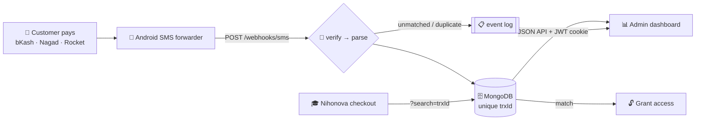

# 💸 SMS Payment Verification Gateway

**Turns a personal mobile-money number into a real payment gateway — parsing ~500 live transactions a month for [Nihonova Academy](https://www.nihonovaacademy.com/), a JLPT e-learning SaaS.**

[](#-the-admin-dashboard)
[](#-the-admin-dashboard)
[](#️-the-backend)
[](#️-data-model)
[](#-run-it)

**🎓 Live product:** [nihonovaacademy.com](https://www.nihonovaacademy.com/) &nbsp;·&nbsp; **📦 Project page:** [github.com/mrahmann0010/smsServer](https://github.com/mrahmann0010/smsServer)

---

## 🎯 What it does

A small SaaS in Bangladesh **can't get a card gateway or an MFS merchant API**. Payments landed on a
personal bKash number and were verified by hand — read the SMS, check the amount, unlock the content.

This service automates the whole loop:

> Customer pays → the SMS hits an Android phone → forwarded to a signed webhook → parsed into a
> structured transaction → stored in MongoDB, deduplicated by `trxId` → checkout queries that ID and
> **unlocks the purchase instantly**.

Money that arrived as unstructured text is now queryable, auditable data — with an operator
dashboard on top of it.



---

## 📊 The Admin Dashboard

A **SvelteKit 2 / Svelte 5 (runes)** SPA — the operator's window into the money. Not a CRUD table:
it's a monitoring tool built around one question, *is the pipeline still trustworthy right now?*

### Stack

| | |
|---|---|
| **Framework** | SvelteKit 2 · Svelte 5 runes (`$state` / `$derived`) · TypeScript |
| **Data layer** | TanStack Query v6 (Svelte runes API) — `createQuery` / `createInfiniteQuery` |
| **Charts** | Chart.js with a custom axis renderer |
| **Styling** | Tailwind v4 — tokens in one `@theme` block, zero `<style>` blocks, no `tailwind.config.js` |
| **Deploy** | Vercel (`adapter-vercel`, Node 20) |

### Features

- **Infinite-scroll ledger** — `createInfiniteQuery` with 300ms-debounced search over `trxId` or
  sender, platform filtering, and a detail modal showing the original SMS. Flattened pages are
  de-duplicated by `platform + trxId`; the desktop table collapses to stacked cards below 720px.
- **Live analytics** — per-platform totals, revenue and payment counts per day, period-over-period
  comparison, and a peak-hours histogram, all bucketed in **Bangladesh time** from UTC-stored data.
- **Custom reports** — any date range → totals, fees, daily series, and a top-senders breakdown
  (sender identity is the phone string, shared across platforms).
- **Pipeline-trust alerts** — a masthead bell recomputes from the latest stats + health on every
  refresh, distinguishing *"this platform was never wired up"* from *"this forwarder went quiet"* —
  a config gap versus lost revenue.
- **Health view** — data freshness, webhook-event counts, and a recent-rejections log, so an
  unparsed message format surfaces as a signal instead of a silent gap.
- **Freshness without hammering the API** — one `QueryClient` sets a 10-minute background poll as a
  fallback and leans on refetch-on-window-focus for the real-time feel. Query keys are centralized
  so invalidation stays consistent; any `401` triggers a global logout.
- **Honest states** — distinct components for *empty* ("nothing here yet"), *error* ("the forwarder
  stopped"), and *load failure*. A quiet day must never look like a broken pipeline.
- **Built to be read against a screenshot** — every ID, phone number, timestamp, and taka amount is
  JetBrains Mono with tabular figures, so an admin can compare a row to a student's screenshot
  character for character.

Session state lives client-side only; **every byte of data comes from the API** over credentialed
requests, so the SPA deploys to a different origin than the server with no shared runtime.

---

## ⚙️ The Backend

Express 5 + Mongoose 9. Every decision below exists because a real payment went through it.

**Idempotent by construction.** The forwarder delivers *at least once*. Instead of a dedup table,
`trxId` carries a **unique index** — a retry fails at the database with `11000`, which the route
turns into `{ processed: false, reason: 'duplicate' }`. The idempotency key *is* the schema.

**Correct status codes.** Anything understood as "not a payment" — unknown sender, promo SMS,
outgoing money — returns `200` so the forwarder retires the message. Only a genuine server fault
returns `500`, because that one *should* be retried.

**Parsing messy text.** Three pure parsers (bKash / Nagad / Rocket) behind a `parsePayment`
dispatcher emit one normalized shape. bKash alone ships several formats; only **incoming** money is
stored. A new format is a regex plus a test case, never a change to the ingest path.

**Timezone correctness.** Timestamps are stored in **UTC** and bucketed at **UTC+06:00**, so a
payment at 11:40pm Dhaka lands on the right day. The SMS's original local-time strings are kept
verbatim beside the parsed `Date`.

**Operational hardening.** One pooled Mongoose connection opened before the listener (5s server
selection instead of the 30s default, bounded 5s buffering, concurrent-connect dedup) · rejected
events written fire-and-forget to a `WebhookEvent` log that can never delay a webhook · structured
`LEVEL SCOPE event {fields}` logging · shared-secret webhook auth · bcrypt + **httpOnly JWT cookie**
sessions with credentialed CORS that echoes the exact origin, never `*` · compression and projected
queries to keep raw SMS text off the wire.

### 🔌 API

| Endpoint | Purpose |
|---|---|
| `GET /health` | Liveness probe |
| `POST /webhooks/sms?token=` | Ingest a forwarded SMS. Always `200`; body reports `processed` + `reason`. |
| `POST /admin/auth/login` · `logout` · `GET /me` | JWT-cookie session |
| `GET /admin/api/payments` | Paginated list — `?platform=&page=&limit=&search=` |
| `GET /admin/api/stats` | Totals · 14-day series · period comparison · peak hours |
| `GET /admin/api/reports` | Date-range totals/fees/series + top senders — `?from=&to=` |
| `GET /admin/api/health` | Freshness · event counts · recent events |

> **Verification is query-based by design.** Checkout hits `/admin/api/payments?search=<trxId>` and
> matches ID and amount. No `/verify` endpoint, no stored `verified` flag — the unique `trxId` *is*
> the source of truth, so verification can't drift out of sync with ingestion.

### 🗄️ Data model

One schema factory builds three collections (`bkash`, `nagad`, `rocket`) so providers never collide
on lookalike IDs: `amount`, `sender`, `fee`, `balance`, **`trxId` (unique)**, `dateReceived` (UTC,
indexed), raw date/time strings, `simNumber`, `rawMessage`, plus `ref` for Nagad. A `users`
collection holds dashboard credentials; `WebhookEvent` holds the ingest log.

---

## 📁 Layout

```
apps/
  web/       SvelteKit 2 + Svelte 5 dashboard  → Vercel
    src/routes/   dashboard · transactions · reports · health
    src/lib/      api.ts (typed client) · query.ts · components/ · stores/
  server/    Express 5 API                     → Docker
    src/routes/       webhook.js · admin.js · auth.js
    src/services/     parsePayment + 3 parsers · jwt · logger · timeUtil
    src/models/       createPaymentModel factory · Bkash/Nagad/Rocket · User · WebhookEvent
    src/middleware/   verifySignature.js
    src/config/       db.js
```

## 🚀 Run It

```bash
# API
cd apps/server
npm install
cp .env.example .env      # MONGO_URI · WEBHOOK_SECRET · JWT_SECRET · CORS_ORIGIN · *_SENDER
npm run seed-admin        # create the first dashboard user
npm run dev               # or: docker compose up -d  (API + MongoDB)

# Dashboard
cd apps/web
npm install               # set PUBLIC_API_BASE_URL to the API origin
npm run dev               # → localhost:5173   ·   npm run check → 0 errors, 0 warnings
```

Point the "Incoming SMS to URL Forwarder" Android app at
`https://your-api-domain.com/webhooks/sms?token=<WEBHOOK_SECRET>`, then sign in with the seeded user.

---

## 📈 Business Impact

| | |
|---|---|
| **~500 transactions / month** | Parsed, deduplicated, and queryable in real time — nobody reads an SMS. |
| **0% gateway commission** | MFS merchant APIs and card gateways charge per transaction; running on a personal number keeps that percentage as **retained revenue**. |
| **Manual → instant** | Checkout resolves a `trxId` and unlocks content immediately instead of waiting on an admin. |
| **Unblocked a market** | Card gateways are out of reach for a small Bangladeshi SaaS. This made online selling possible at all. |
| **Auditable by default** | Every payment keeps its raw SMS and original timestamps; every rejection is logged. Disputes are settled by lookup. |

---

**Moshiur Rahman** · Built to power real payments for **[Nihonova Academy](https://www.nihonovaacademy.com/)**.
